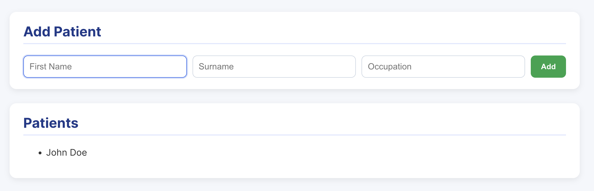
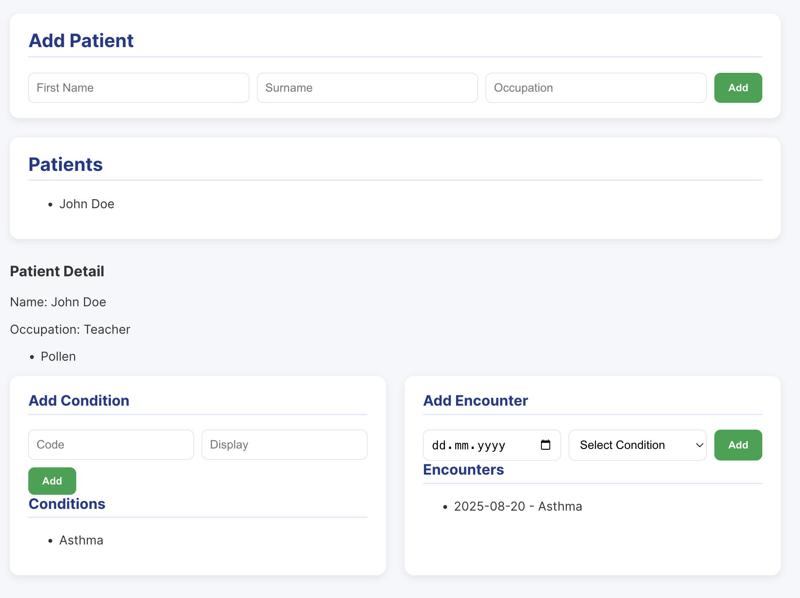

# Healthcare Data App - Frontend

This project was bootstrapped with [Create react app](https://github.com/facebook/create-react-app).

##  Scripts

In the project directory, you can run:

### `npm start`

Runs the app in the development mode.\
Open [http://localhost:3000](http://localhost:3000) to view it in the browser.

The page will reload if you make edits.\
You will also see any lint errors in the console.

### Screenshot

On the main screen, you can see a list of existing patients.

 

When you click a patient, detailed information appears — including their conditions and encounters.

 

You can add new patients, and then add related conditions and encounters.